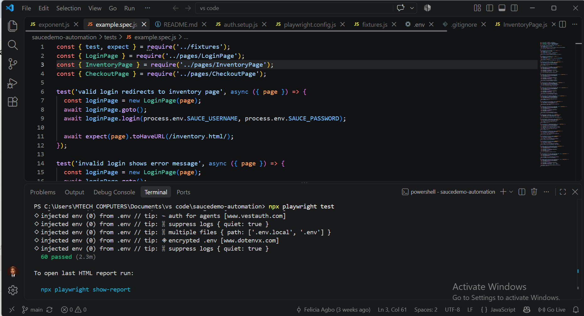
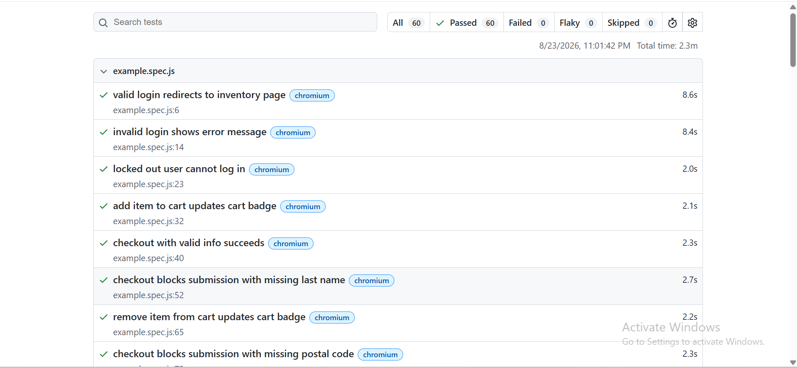

# Sauce Demo – Playwright Test Suite

Automated end-to-end test suite for [saucedemo.com](https://www.saucedemo.com), a QA testing demo application, built with **Playwright** and **JavaScript** using the **Page Object Model (POM)** pattern.

This suite translates my earlier [manual test cases](https://github.com/agbooluchi76-prog/SauceDemo-Testing-Portfolio-01) for the same site into automated, repeatable tests.

## Tech Stack

- **Playwright** – browser automation and test runner
- **JavaScript (Node.js)** – language
- **dotenv** – environment-based credential management
- **Page Object Model** – LoginPage, InventoryPage, CheckoutPage classes

## Project Structure
saucedemo-automation/
├── tests/
│ └── example.spec.js # all 20 test cases
├── pages/
│ ├── LoginPage.js
│ ├── InventoryPage.js
│ └── CheckoutPage.js
├── fixtures.js # shared loggedInPage fixture
├── auth.setup.js # storageState experiment (see notes below)
├── .env # test credentials (not committed)
└── playwright.config.js

## Features Covered

- **Login** – valid credentials, invalid credentials, locked-out user
- **Cart** – add item, remove item, multiple items, badge accuracy, cart persistence
- **Checkout** – valid submission, missing last name, missing postal code, all fields empty, cancel flow, item/quantity verification
- **Sorting** – price low-high, price high-low, name A-Z, name Z-A
- **Navigation** – logout flow

20 automated test cases, 60 test runs across Chromium, Firefox, and WebKit.

## Getting Started

npm install
npx playwright install

Create a `.env` file in the project root:

SAUCE_USERNAME=standard_user
SAUCE_PASSWORD=secret_sauce
BASE_URL=https://www.saucedemo.com

Run the full suite:

npx playwright test

Run a single browser:

npx playwright test --project=chromium

View the last report:

npx playwright show-report

## Architecture Notes

**Page Object Model.** Each page (login, inventory, checkout) is described once as a class in `pages/`, with locators and reusable methods. Tests call these methods instead of writing raw locators directly, so a UI change only needs to be fixed in one place.

**Fixtures.** A custom `loggedInPage` fixture (`fixtures.js`) handles the login flow once, before each test body runs, cutting repeated setup across the suite.

**Credentials.** Stored in a `.env` file, excluded from version control, loaded via `dotenv`.

## A Note on storageState

`auth.setup.js` logs in once and saves the session to `auth.json`, intended to let tests skip login entirely via Playwright's `storageState`. In practice, this didn't work reliably against Sauce Demo: the site tracks login state using `sessionStorage`, which `storageState` does not persist (it only captures cookies and `localStorage`). Tests loading the saved session were redirected back to login.

Left the setup script in the repo as a working example of the technique, documented here rather than removed silently. The `loggedInPage` fixture is the approach actually used across the suite.

## Test Results

20 automated test cases, 60 test runs across Chromium, Firefox, and WebKit. Full suite passes consistently, with one known intermittent WebKit logout flake tied to menu animation timing (see notes above).

## What I Learned

- Converting manual test cases into automated scripts forced me to think about timing and waits in a way manual testing never required.
- Page Object Model made a real difference once the suite passed 10+ tests, not before. Refactoring mid-build taught me why teams enforce this pattern early.
- Attempting `storageState` and having it fail for a specific reason (Sauce Demo uses `sessionStorage`, which `storageState` doesn't persist) taught me more than if it had worked on the first try.
- Moving hardcoded URLs into `baseURL` and `.env` seemed like a small change, but it's the difference between a script and something closer to a real framework.

## Author

Felicia Agbo — [LinkedIn](https://linkedin.com/in/agbo-felicia03) · [GitHub](https://github.com/agbooluchi76-prog)